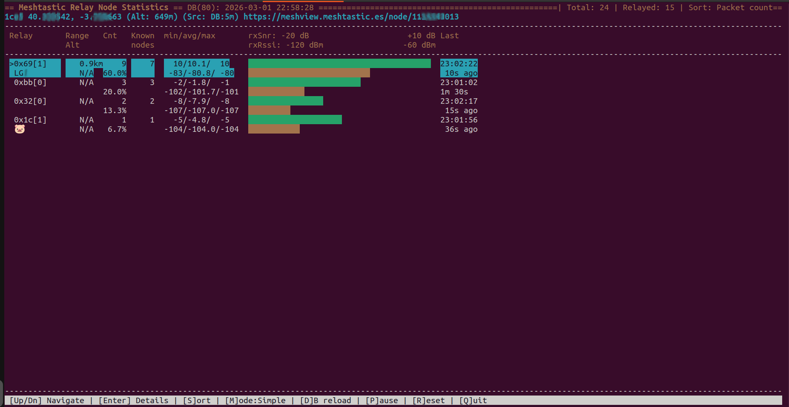
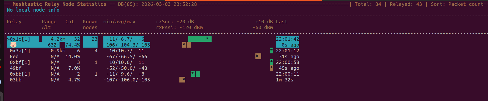
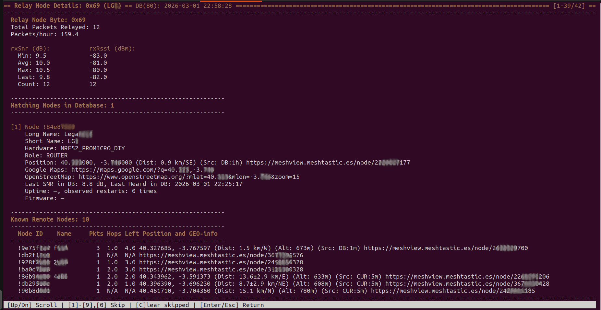

# Meshtastic Relay Node Statistics – User guide

This utility shows **SNR** (signal-to-noise ratio) and received packages' **signal levels** (rxSnr, rxRssi) for different **relay nodes** that forward Meshtastic packets toward your location, and lists the **remote nodes** whose traffic each relay carries. 

Each routed Meshtastic message has a one-byte field in the packet header (offset 0x0F) that identifies which node retransmitted it: when a node rebroadcasts a packet, it writes its own identifier—the *relay node of the current transmission*—into that field. For how packets are relayed and how the relaying node sets this byte, see the [Mesh Broadcast Algorithm](https://meshtastic.org/docs/overview/mesh-algo/) (Layer 1 packet header table and Layer 3 multi-hop messaging).

Directly received messages are not accounted as relayed, but can be used to obtain some important information.

The tool runs on your PC and connects to a **local Meshtastic node** over USB serial or Bluetooth (BLE), uses the packets your node receives to build statistics, and does not replace the node. Y0ou may need to be in the dialout group.

The interface is a **TUI** (terminal UI), so it is better to run this application on laptop / PC.

---

## Prerequisites and dependencies

- **Python:** 3.8 or newer. The `curses` module used by the TUI is part of the standard library on Linux and macOS.
- **Libraries:**
  - **meshtastic** – connection to the device (serial and BLE). Installs `pyserial` as a dependency.
  - **pypubsub** – provides the `pubsub` module used for receive events.
- **Hardware:** A Meshtastic device (local node), USB cable for serial, or a BLE-capable computer for Bluetooth.  
  **Note:** BLE connection may not work on some Linux setups (drivers, permissions).

Install all dependencies at once using the provided file:

```bash
pip install -r requirements.txt
```

This project is licensed under the **GNU General Public License v3.0**; see the `LICENSE` file in the project root.

---

## Installation and how to run

1. Install dependencies: `pip install -r requirements.txt`
2. Run the utility.

**Examples:**

```bash
# Connect via USB serial (Linux)
python3 mesh_stats.py --serial /dev/ttyACM0

# Connect via BLE (device name or address)
python3 mesh_stats.py --ble "Meshtastic_xxxx"

# With Meshview link (node pages in browser)
python3 mesh_stats.py --serial /dev/ttyACM0 --meshview https://meshview.meshtastic.es

# Record packets to a file for later replay
python3 mesh_stats.py --serial /dev/ttyACM0 -w packets.dat

# Replay from a recorded file (no device needed)
python3 mesh_stats.py -r packets.dat

# Replay at 5x speed
python3 mesh_stats.py -r packets.dat --speed 5
```

---

## Main screen

The purpose of this screen is to see all possible **intermediate relays** that transmitted packets to you, excluding nodes that send packets directly (without being relayed). A node close to you can be a relay too if it retransmits packets from remote nodes that your node then receives. A relay is identified in the protocol by **only one byte** (the relay-node field), so it cannot be uniquely resolved to a single device; the utility uses the node database and “Matching nodes” in the detail view to **guess** which node is likely that relay (e.g. by last byte of node ID and optional skip list). In the Main view the number of guessed nodes is displayed.

**Full screenshot:** See Figure 1 – full main TUI with Simple mode active.



*Figure 1: Main screen (Simple mode).*

### Header line

The top line shows:

- **Title:** “Meshtastic Relay Node Statistics”
- **DB(count): date/time** – node database load time and number of nodes in the DB
- **Spinner** – rotates while packets are being received
- **Total** – total packets received by your node
- **Relayed** – packets that had relay information (counted in the table)
- **Sort:** – current sort mode (e.g. Packet count)
- **PAUSED** – shown when packets' receiving are paused and all of them are dropped (key **P**)

### Local node line

The line under the header is for your **local node**: short name or ID, GPS coordinates, altitude, and source/age of the position (e.g. DB:5m). If you started the tool with `--meshview URL`, a Meshview link for the local node appears on this line.

### Table headers

The table has these columns:

- **Relay** – relay identifier (hex byte, e.g. 0x69[1], where the number in square brackets is a quantity of guessed nodes); under it the node name if unique in a case only one node is guessed to be relay for a given hex-number
- **Range** and **Alt** – distance (km) and altitude (m) when position is known in case of only one guessed node
- **Cnt** – number of relayed packets; below it, percentage of total relayed
- **Known nodes** – number of distinct remote nodes that sent packets via this relay
- **min/avg/max** – minimum, average, and maximum for rxSnr and rxRssi
- **rxSnr** bar scale from -20 dB to +10 dB
- **rxRssi** bar scale from -120 dBm to -60 dBm
- **Last** – time of last packet and time spent the last packet was received

### Relay row (example)

Each relay uses two rows:

- **Row 1:** Relay ID (e.g. `0x69[1]`), range (km), packet count, known nodes count, SNR min/avg/max, RSSI min/avg/max, **bar graphs** (SNR and RSSI), and “Last” time with “X ago”.
- **Row 2:** Node name (if exactly one node matches), altitude or N/A, percentage of relayed traffic, and the same bar and “Last” columns.

**Sort modes:** You can sort by Packet count, Percentage, Avg rxSnr, Avg rxRssi, or Node name (key **S**).  
**Bar mode:** Key **M** switches between **Simple** (only current level) and **Complex** (min/avg/max and last value; see below).

### Complex display mode

See the [screenshot below](#complex-display-mode) for an example. In **Complex** mode each bar shows:

- **Range of the signal level:** The bar is filled between the **minimum** and **maximum** observed value (the span of the signal over time).
- **Last received signal:** A **\*** (asterisk) marks the position of the **last** received value. It appears in a **blinking** (flash) style for a short time after a new packet is received.
- **Average:** A **|** (pipe) marks the **average** value.
- **Priority:** If the average and the last value fall at the same position, the **last-received** mark (**\***) is shown (so the asterisk has priority over the pipe when they coincide).



*Figure 2: SNR and RSSI bars in Complex mode (fragment).*

### Footer

The bottom line lists keyboard shortcuts.

- **[Up/Dn]** – move selection
- **[Enter]** – open detail view for the selected relay
- **[S]** – change sort mode
- **[M]** – switch bar mode (Simple / Complex)
- **[D]** – reload node database (only when connected to a device; not in replay)
- **[P]** – pause / resume statistics
- **[R]** – reset statistics
- **[Q]** – quit

**[R]** clears all collected relay statistics (packet counts, SNR/RSSI, known nodes per relay) so you can start a fresh measurement; the node database and skip list are not changed. 

**[D]** reloads the node database from your local device so that names, positions, and other node info used for “Matching nodes” and relay labels are up to date. The loaded database is shown in the **header line** (DB known node count and load date/time at the top of the screen).

## Detail view

The detail view gives you **knowledge** about a relay identified by its one-byte value: which nodes might be that relay, what characteristics they have, and which remote nodes your device has **heard** (received packets from) via this relay. It shows the **full list of nodes that may be the relay** (from your node database, by matching the relay byte) with detailed info for each: position, hardware, signal, and so on. It also shows the **list of nodes whose packets were retransmitted by this relay** (the “Known remote nodes” table), i.e. the traffic that passed through it. Together this answers: what the guessed relay node looks like, and which nodes are being RXed through it.

Open the detail view by selecting a relay and pressing **Enter**. Exit with **Enter** or **Escape**.

**Full screenshot:** See Figure 3 – detail view for one relay (example without skipped nodes).



*Figure 3: Detail view for one relay.*

### Title bar

Shows “Relay Node Details: &lt;hex&gt;” and optionally “(name)”, plus DB load time and node count.

### Basic relay block

- **Relay Node Byte** – hex identifier for this relay
- **Explicitly skipped relay nodes** – if you skipped any nodes for this relay (see Skip), they are listed here
- **Total Packets Relayed** – packet count for this relay
- **Packets/hour** – rate

### rxSnr / rxRssi block

Numeric stats for this relay: **Min**, **Avg**, **Max**, **Last**, and **Count** for both rxSnr (dB) and rxRssi (dBm).

### Matching Nodes in Database

This section lists nodes from your **local node database** whose **last byte** of their node ID matches this relay’s byte (so they are candidates for being this relay).

For each such node you see:

- **[1], [2], …** – index (used for “skip” keys)
- **Node !xxxxxxxx** – node ID in hex
- **Long Name** / **Short Name**
- **Role** – device role (e.g. ROUTER, CLIENT)
- **Hardware** – hardware model
- **Position** – coordinates, distance, altitude, direction; **Google Maps** and **OpenStreetMap** links when position is known
- **Last SNR in DB** / **Last Heard in DB**
- Other info when available (e.g. firmware version, uptime, telemetry such as battery, temperature)

This information helps you choose the **most advantageous location** for your node. **Device role** matters: ROUTER or CLIENT nodes are typically more likely to relay traffic than CLIENT_MUTE, so role hints at how useful a candidate relay is. **Uptime and observed restarts** show stability - long uptime and few restarts suggest a relay that stays online; frequent restarts may mean power or firmware issues, eg. a solar node whose an accumulator is not enough for the night. Reliability over time is reflected in steady packet counts and signal stats. **Power supply** (from telemetry: battery level, voltage, or lack of battery for mains-powered nodes) tells you whether a relay may go offline when a battery runs down or when there is little sun for solar. As a rule of thumb, having **two or three** nodes with ROUTER or CLIENT role in range is often better than a single node with the best SNR, because redundancy improves connectivity when one relay is busy, restarts, or is temporarily out of range.

If you see “No matching nodes” or “(Node may not have sent its nodeinfo)”, the relay might not have sent nodeinfo yet or might not be in the DB.

### Known Remote Nodes table

This table shows the **remote nodes** whose packets were retransmitted by this relay. For each node you see **distance, altitude, and direction** (same common node data as elsewhere), the **number of packets** received from that node via this relay, and **Hops** - the initial hops limit the packet took, **Left** - the current limit the packet has and their difference shows how many nodes packet has already traveld which indicates how “close” the node is in the mesh. Some relays mainly retransmit traffic from one direction (e.g. N or NE), so the directions of the remote nodes in this table can reveal that pattern and help you judge where the relay “hears” from. Packets from some node can be relayed through different relay, and be in the "Known remote nodes" for two or more relays. It is essential to study this info, if you should receive data from a given remote node or a cluster of them.

A table of the **remote nodes** that actually sent packets **via** this relay (the “from” nodes):

- **Node ID**, **Name**, **Pkts**, **Hops**, **Left**, **Position and GEO-info**
- One row per distinct remote node; rows are sorted by packet count (descending).


### Detail footer

- **[Up/Dn]** – scroll the detail text
- **[1]–[9], [0]** – add the matching node at that index to the skip list (with confirmation)
- **[C]** – clear all skipped nodes for this relay (with confirmation)
- **[Enter/Esc]** – return to main screen

**Skip:** Skipping a node (keys [1]–[9], [0]) excludes it from being treated as this relay (e.g. when several nodes share the same last byte and one is clearly not the relay). A confirmation popup is shown before node will be skipped. Skipped nodes are listed in “Explicitly skipped relay nodes” and can be cleared with **[C]**. You can also skip from the command line with `--skip-relay !xxxxxxxx` (repeatable). Purpose: ignore nodes that share the same last byte as the relay but are obviously not the relay.


## Common node data (position line)

In the Meshtastic network, nodes share their position via position broadcasts and store learned positions in a local node database. The position shown for a node in this utility can come from the **node database** (positions learned earlier from the mesh) or from **packets received over the air** (e.g. a position packet or nodeinfo from that node). The “Information source” (see below) indicates which of these applies and how old the data is. The following fields can appear on the node/position line.

The **node/position line** (e.g. on the main screen for the local node, or in detail for a matching node) typically includes:

- **Position** – latitude and longitude
- **Range** – distance (e.g. “Dist: X.X±D.D km”), optional direction (e.g. “/NE”), and optional uncertainty (±D.D km) when position is obfuscated
- **Altitude** – “Alt: Xm” when available
- **Information source** – e.g. “Src: DB:5m” (source and age of the position). Source is **DB** (from node database) or **CUR** (current/live). Age is shown as one of the discrete grades below.
- **Meshview link** – URL to the node on the Meshview site, when `--meshview` is set, you can use Ctrl+leftMouseClick to open the link in your browser

**Data age** (in “Src: *source*:*age*”) is bucketed into fixed grades, not exact seconds. All possible values:

| Age shown | Meaning (data older than … and not older than …) |
|-----------|--------------------------------------------------|
| 1m        | 0 and under 1 minute                             |
| 5m        | 1 minute and under 5 minutes                     |
| 30m       | 5 minutes and under 30 minutes                   |
| 1h        | 30 minutes and under 1 hour                      |
| 12h       | 1 hour and under 12 hours                       |
| 1d        | 12 hours and under 1 day                         |
| 1w        | 1 day and under 1 week                           |
| 1y        | 1 week and under 1 year                          |
| ??        | 1 year or older (or unknown)                      |

If no timestamp is available, only the source is shown (e.g. “Src: DB”) with no age.

**Direction** (shown after distance, e.g. “Dist: 2.1 km/NE”) is the compass bearing from your position to the node. All possible values:

| Direction | Meaning | Bearing (degrees) |
|-----------|---------|-------------------|
| N         | North   | 337.5–22.5        |
| NE        | Northeast | 22.5–67.5      |
| E         | East    | 67.5–112.5        |
| SE        | Southeast | 112.5–157.5    |
| S         | South   | 157.5–202.5       |
| SW        | Southwest | 202.5–247.5    |
| W         | West    | 247.5–292.5       |
| NW        | Northwest | 292.5–337.5    |
| un        | Unknown (e.g. position obfuscation radius larger than distance) | — |

---

## Recording and replay

- **Recording:** Use `-w FILE` with `--serial` or `--ble`. The tool writes received packets and a snapshot of the node database to the file (overwrites if it exists). Useful for later analysis or demos.
- **Replay:** Use `-r FILE`. No device is needed. Packets are read from the file and fed into the same logic as live data. Use `--speed FACTOR` (e.g. `--speed 5` for 5x). Replay is useful for demos or offline inspection.

---

## Optional features

- **Meshview:** `--meshview URL` – base URL of a Meshview instance (e.g. `https://meshview.meshtastic.es`). The TUI then shows links to node pages on that site (e.g. on the local node line and in detail).
- **Skip relay:** `--skip-relay !xxxxxxxx` – do not treat this node as a relay (by Meshtastic ID in hex, e.g. `!9e75f1a4` or `9e75f1a4`). Can be repeated for several nodes.

---

## Troubleshooting

- **Serial port:** On Linux, you may need to be in the `dialout` group or use `sudo`. Use the correct device path (e.g. `/dev/ttyACM0`, `/dev/ttyUSB0`).
- **BLE:** Use the device name (e.g. `Meshtastic_abcd`) or Bluetooth address. Some Linux systems have limited BLE support.
- **BLE:** Ony one device can be connected to meshtastics node thorough Bluetooth.
- **“No matching nodes” in detail:** The relay may not have sent nodeinfo yet, or it might not be in the local node DB.
- **Replay:** The `.dat` file must have been recorded with `-w` by this (or a compatible) version of the utility.
- **DB**  reload command doesn't force reloading base, just updates DB snapshot.
